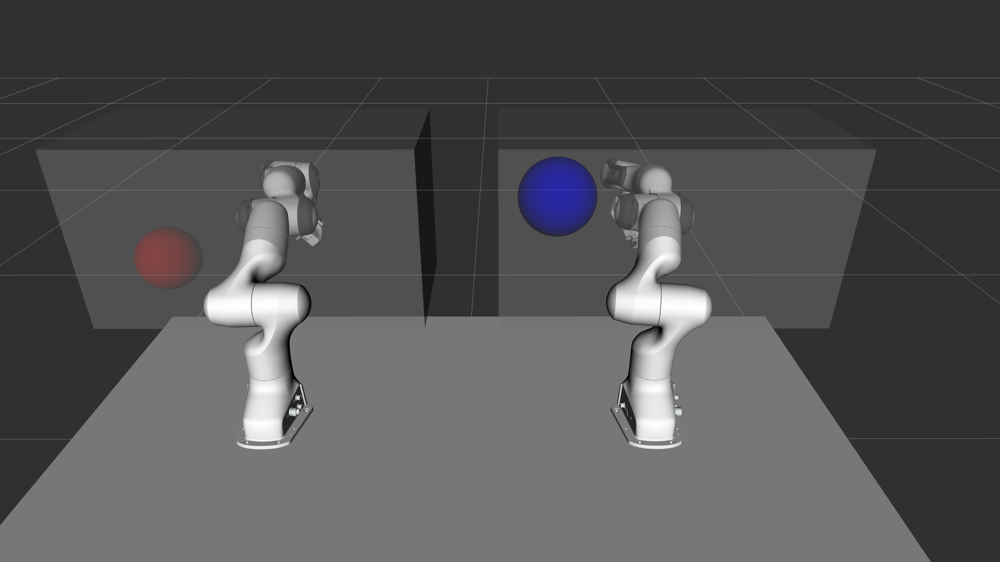

# Pose Game
This is a simple pose game used for testing performance on the moveit_vive package. The results from testing this game on a diverse setup people are presented in the thesis (link soon to arrive).

To run the game first start [vive_ros (modified)](https://github.com/Machine-Jonte/vive_ros) and [moveit_vive](https://github.com/Machine-Jonte/moveit_vive) before running:

```
rosrun pose_game game.py <random_seed>
```
Note, the game needs to run the previous packages to work properly as it is subscribing to the data from moveit_vive, which in turn is subscribing to vive_ros.

<p align="center">
  
</p>

